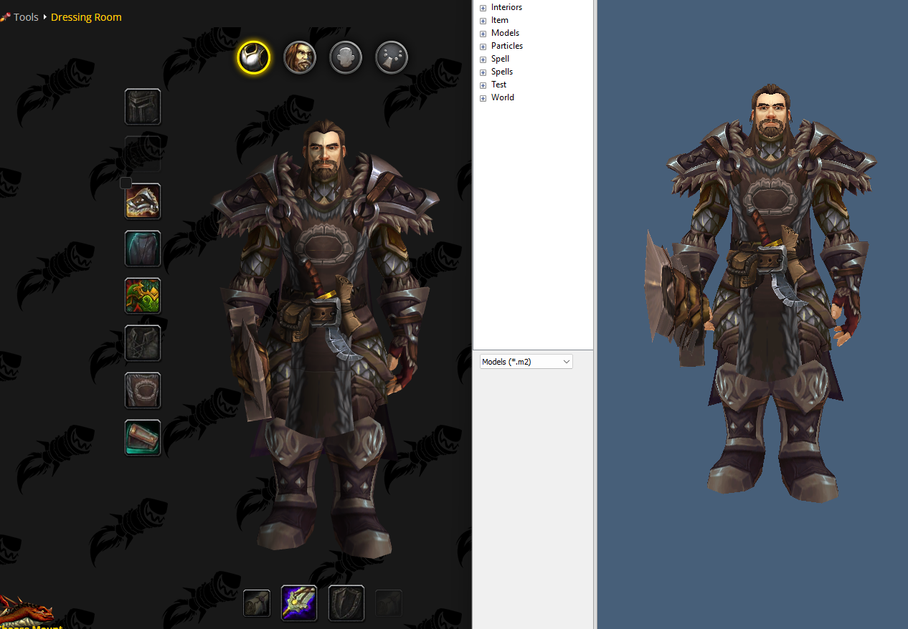
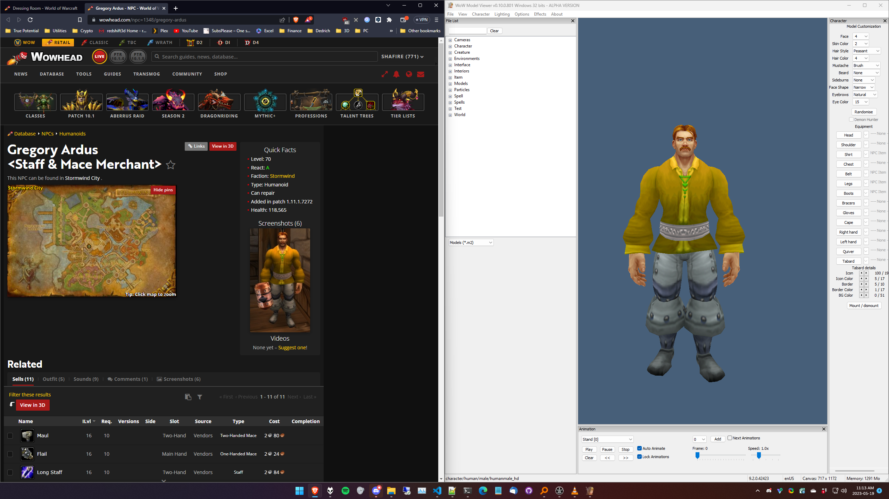

# wowhead_to_wmv
 A script to convert Wowhead NPC / Dressing room / Outfit URLs to WoW Model Viewer .CHR files!

# Usage

Please ensure you have all dependencies before running!

## Ensure that you change the `exportRoot` in `generate_wmv_character.py` this sets the rootpath for exports!

1. Navigate to the folder in a terminal window.
2. run `generate_wmv_character.py`
3. It will ask you for a wowhead URL, here are some examples of acceptable ones:
- `https://www.wowhead.com/outfit=41302/kharazim`
- `https://www.wowhead.com/npc=1333/gerik-koen`
- `https://www.wowhead.com/dressing-room#fz80c0zb89c8a8I8s8z8q848b8zR8fh8M2Q8d8zh8fu8M218sc8zya8fG8M3k8k58zdN8zYw8dAG877GqHA87cRxR808cTo808OE87VMTt808mlt808cnb808MTe87q`
4. If you use a dressing-room link it will ask you for a character name.
5. If all goes well, it will generate a .CHR file to import into WMV and copy the location of it to the clipboard!

---

# Dependencies Installation Guide

The following is a list of Python and Node.js dependencies required.

## Python and Node.JS

Before running the scripts, make sure you have Python and Node.js installed in your system.

For Python:

1.  Check if you have Python installed by running `python --version` or `python3 --version`.
2.  If Python is not installed, download and install it from the official website: [https://www.python.org/downloads/](https://www.python.org/downloads/)

For Node.js:

1.  Check if you have Node.js installed by running `node --version`.
2.  If Node.js is not installed, download and install it from the official website: [https://nodejs.org/en/download/](https://nodejs.org/en/download/)

## Python Dependencies

### pyperclip

Pyperclip is a cross-platform Python module for copy and paste clipboard functions.

Installation:
`pip install pyperclip` 

## Node.js Dependencies

You can install Node.js dependencies using npm, the Node.js package manager. Run the following commands in your terminal:

### puppeteer

Puppeteer is a Node library which provides a high-level API to control Chrome or Chromium over the DevTools Protocol.

Installation:
`npm install puppeteer` 

### axios

Axios is a promise-based HTTP client for the browser and Node.js.

Installation:
`npm install axios` 

## PLEASE NOTE!!

THIS HAS ONLY BEEN TESTED WITH THE FOLLOWING:
1) WoW Model Viewer v0.10.0.801
2) wow 9.2.0.42423
